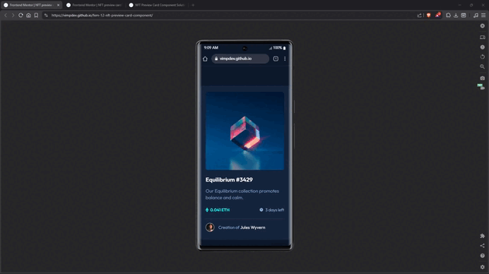

# 🚀 Frontend Mentor - NFT preview card component solution

This is a solution to the [NFT preview card component challenge on Frontend Mentor](https://www.frontendmentor.io/challenges/nft-preview-card-component-SbdUL_w0U).  
The goal of this project is to build a responsive card component and reproduce the design as accurately as possible while applying modern frontend practices.

---

## 🎬 Demo



---

## 🎯 The challenge

Users should be able to:

- View the optimal layout depending on their device's screen size
- See hover states for interactive elements

---

## 📸 Screenshots

| 📱 Mobile | 📲 Tablet | 🖥️ Desktop |
| --- | --- | --- |
|  |  |  |

### 🖥️ Desktop interaction &ndash; `:hover` & `:focus-visble`


---

## 🔗 Links

- 🌎 [Live site](https://vimpdev.github.io/fem-12-nft-preview-card-component/)
<!-- - 🧑‍💻 [View solution on Frontend Mentor](https://your-solution-url.com) -->

---

## Built with

- Semantic HTML5
- Mobile-first workflow
- Modern CSS
- CSS Layers (`@layer`) for cascade management
- CSS custom properties
- Logical properties
- Flexbox
- CSS Grid
- Custom CSS reset
- Accessible focus states

---

## ♿ Accessibility considerations

Some accessibility improvements were implemented:

- A hidden `<h1>` heading using a `visually-hidden` utility class to preserve a proper document outline.
- All interactive elements are accessible via **keyboard** navigation.
- `:focus-visible` was used to provide **clear focus indicators**.
- Decorative icons use empty `alt` attributes to avoid noise in screen readers.

Example:
```html
<h1 class="visually-hidden">NFT preview card</h1>
```

---

## 🎨 Interesting CSS techniques

### 1️⃣ CSS Layers for architecture

The stylesheet is organized using `@layer` to control the cascade and maintain a predictable architecture:

```css
@layer reset, fonts, tokens, base, components, utilities;
```

This approach separates:

- reset styles
- design tokens
- base styles
- UI components
- utilities

### 2️⃣ Custom reset tailored to the project

Instead of using a full CSS reset library, a **minimal custom reset** was implemented, including:

* consistent `box-sizing`
* reset margins
* responsive images
* improved focus styles

### 3️⃣ Smooth overlay transition on the card image

The hover overlay uses an **opacity transition hack** to avoid a harsh background change and achieve a smoother animation.

```css
.card-media::after {
  opacity: 0;
  transition: opacity .3s ease-in-out;
}

.card-media:hover::after,
.card-media:focus-visible::after {
  opacity: 1;
}
```

This technique avoids abrupt transitions and produces a much smoother interaction.

---

## 📚 Resources

- ManzDev — [CSS Layers explanation](https://lenguajecss.com/cascada-css/especificidad/regla-layer/)

- Kevin Powell — [CSS Layers tutorial](https://youtu.be/NDNRGW-_1EE?si=7tMb2T2JIknrzEjm)


## 👩‍💻 Author

- Frontend Mentor &ndash; [@vimpdev](https://www.frontendmentor.io/profile/vimpdev)

---